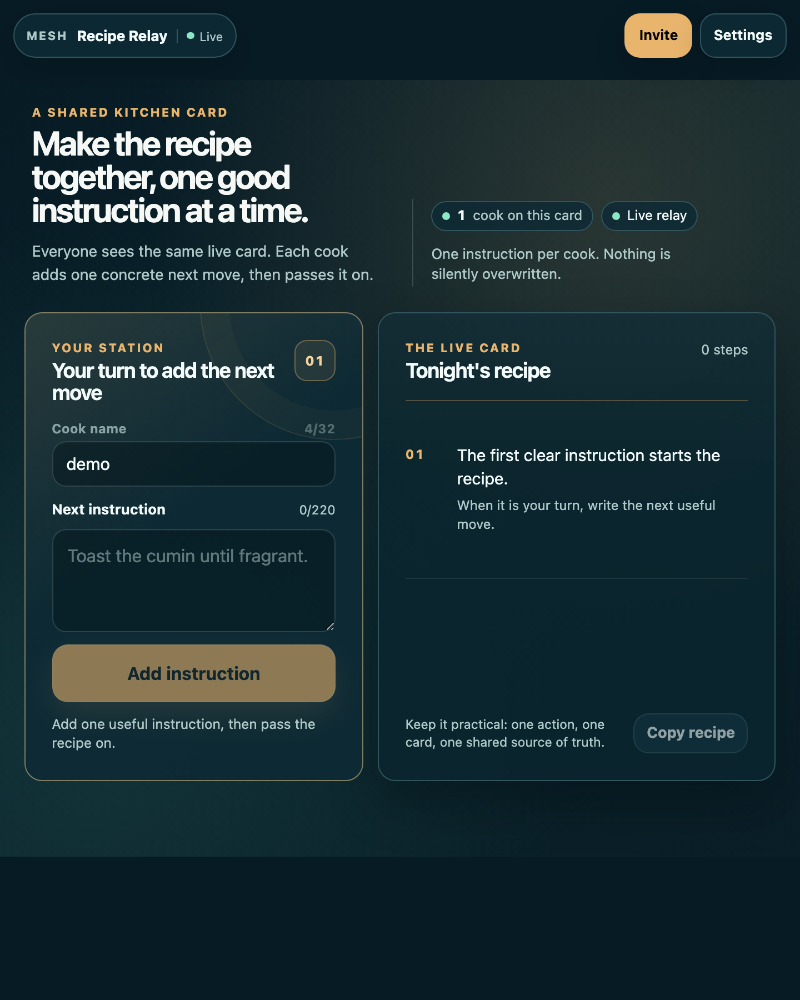
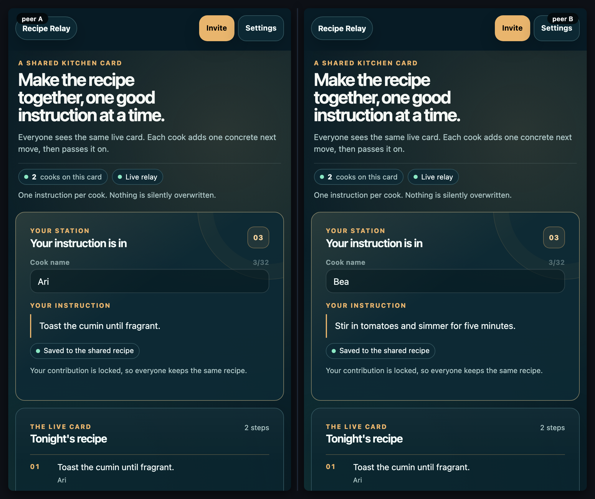

# Recipe Relay

[](https://baditaflorin.github.io/mesh-recipe-relay/)
[](https://github.com/baditaflorin/mesh-recipe-relay/blob/main/package.json)
[](./LICENSE)

> A shared kitchen card where every cook contributes one clear next step.

**Live:** https://baditaflorin.github.io/mesh-recipe-relay/

**Source:** https://github.com/baditaflorin/mesh-recipe-relay





## What it does

Recipe Relay turns a group recipe into a calm, turn-based shared card:

- Every connected cook sees the same ordered instructions.
- Each cook can publish exactly one concrete next instruction.
- The active turn advances deterministically, so people do not overwrite one another.
- The finished card can be copied as plain text.

There is no application database or account. Recipe state lives in a Yjs document shared directly between browsers in the same room.

## Use it

1. Open the [live app](https://baditaflorin.github.io/mesh-recipe-relay/) on the first device.
2. Use **Invite** in the top bar to share the current room with the other cooks.
3. Add a name, wait for the active turn, then write one useful instruction.
4. Continue until the card is complete, then select **Copy recipe**.

The room link is the access boundary. Anyone who joins it can read the shared recipe, so share it deliberately.

## Local development

`mesh-common` must sit next to this repository because the app consumes it through `file:../mesh-common`.

```bash
git clone https://github.com/baditaflorin/mesh-common
git clone https://github.com/baditaflorin/mesh-recipe-relay
cd mesh-common && npm ci
cd ../mesh-recipe-relay && npm ci
npm run dev
```

Useful checks:

```bash
npm run fmt:check
npm run typecheck
npm run test
npm run smoke
npm run audit:security
```

`tests/e2e/mesh.spec.ts` includes a real two-peer browser relay: it proves both cooks receive the same two steps in turn order, as well as the 390×844 phone and 1141×602 desktop first-view contracts.

## Privacy and transport

Recipe Relay uses the self-hosted Mesh signaling and TURN infrastructure only to establish browser-to-browser connectivity. The app itself has no backend and does not collect a recipe database. Settings allow participants to inspect or override signaling and TURN endpoints.

<!-- mesh:privacy-section:start -->

Everything you publish to a room is visible to every peer in that room. Your local device's name, key, and choices stay local. Cryptographic signatures prove **who** wrote each entry; they do **not** prevent peers from reading or copying entries. The room URL is the access control — share it deliberately.

See [the privacy and threat model](docs/privacy.md) for the full capabilities used, what other peers in the mesh see, what the self-hosted infrastructure sees, and what stays local.

<!-- mesh:privacy-section:end -->

## Build and release

GitHub Pages serves the committed `docs/` directory from `main`. The repository uses Woodpecker for validation; it clones and installs the sibling `mesh-common` runtime before running formatting, types, unit tests, browser tests, and the Pages build.

```bash
npm run build
npm run screenshot
npm run demo
npm run audit:security
```

The published audit report is available at [security-audit.md](https://baditaflorin.github.io/mesh-recipe-relay/security-audit.md).

## License

MIT — see [LICENSE](LICENSE).
